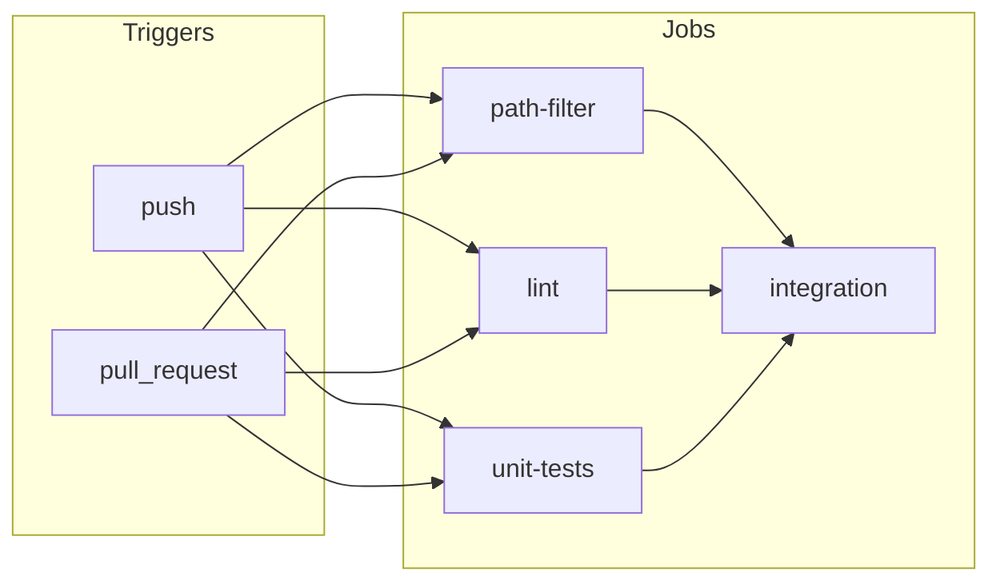

# CI Pipeline and Testing Documentation

## Summary

This project uses a **multi-stage GitHub Actions CI pipeline** to keep the RAG API reliable and maintainable. The pipeline adds **linting**, **unit tests**, and **path-aware integration tests** without changing production behavior. Lint and unit tests run on every push and pull request; the heavier integration stage runs on every pull request and on push only when RAG-related files change.

**Implemented components:**

| Stage        | Trigger                    | Purpose |
|-------------|----------------------------|--------|
| Path filter | Every push and PR          | Decides if integration should run (when `docs/**`, `app.py`, or `embed_docs.py` change). |
| Lint        | Every push and PR          | Enforces style and basic static checks with Ruff. |
| Unit tests  | Every push and PR          | Fast API tests with mocked ChromaDB and FastAPI TestClient. |
| Integration | PR always; push when paths change | Full RAG pipeline: embed docs, start API in mock LLM mode, run semantic tests. |

---

## Architecture



- **path-filter**, **lint**, and **unit-tests** run in parallel on every run.
- **integration** runs only after path-filter, lint, and unit-tests, and only when:
  - the event is `pull_request`, or
  - the event is `push` and at least one of `docs/**`, `app.py`, or `embed_docs.py` changed.

---

## Technical Implementation

### 1. Unit tests

**Goal:** Verify the `/query` endpoint and response shape quickly, without a real database or LLM.

**Stack:**

- **pytest** – Test runner.
- **FastAPI TestClient** – In-process HTTP client; no live server required.
- **unittest.mock.MagicMock** – Replaces the ChromaDB collection so retrieval is deterministic and no `./db` or embeddings are needed.

**Design choices:**

- **Mock LLM:** `USE_MOCK_LLM=1` is set in the test environment (in `conftest.py` before importing `app`). The app then returns the retrieved context as the answer and does not call Ollama, so unit tests need no LLM or API keys.
- **Mock ChromaDB:** The app’s global `collection` is patched with a `MagicMock` whose `query()` returns a fixed structure: `{"documents": [[...]], "metadatas": [[]], "ids": [...]}`. Tests assert on HTTP status, JSON shape, and answer content.
- **No production changes:** Only test code and fixtures were added; `app.py` logic is unchanged.

**Files:**

| File | Role |
|------|------|
| `tests/conftest.py` | Sets `USE_MOCK_LLM=1` before importing `app`; defines `mock_collection` and `client` (TestClient with patched `app.collection`). |
| `tests/test_app.py` | Two tests: (1) `POST /query` returns 200 and answer contains expected keyword; (2) empty documents yield empty answer. |
| `tests/__init__.py` | Marks `tests` as a package. |

**Test cases:**

1. **test_query_returns_200_and_answer** – Uses the `client` fixture (mocked collection returning “Kubernetes is a container orchestration platform.”). Asserts status 200, `answer` in JSON, and substring `"container"` in the answer.
2. **test_query_with_empty_documents_returns_empty_context** – Replaces `app_module.collection` with a mock that returns `documents: []`. Asserts status 200 and `answer == ""`.

**Run locally:**

```powershell
pip install -r requirements.txt pytest httpx
$env:USE_MOCK_LLM = "1"
pytest tests/ -v
```

Or rely on `conftest.py` to set the env and run:

```powershell
pytest tests/ -v
```

---

### 2. Linting

**Goal:** Enforce a consistent style and catch common issues on every push and PR.

**Tool:** **Ruff** (lint + format).

**Config:** `pyproject.toml`:

- `[tool.ruff]`: `exclude = [".venv", "db", ".git", "docs"]`, `line-length = 88`.
- `[tool.ruff.format]`: `quote-style = "double"`.

**CI steps:**

1. Checkout, set Python 3.11.
2. `pip install ruff`.
3. `ruff check .` (lint).
4. `ruff format --check .` (format check only; no write).

**Run locally:**

```powershell
pip install ruff
ruff check .
ruff format --check .
```

To fix format: `ruff format .`.

---

### 3. Path filtering

**Goal:** Run the integration job only when RAG-relevant files change (on push), and always on pull requests.

**Tool:** **dorny/paths-filter@v3**.

**Logic:**

- **On push:** Checkout with `fetch-depth: 2` so the action can compare against the previous commit. No checkout on `pull_request` (action uses GitHub API for changed files).
- **Filter:** Single filter `rag_changed` with paths:
  - `docs/**`
  - `app.py`
  - `embed_docs.py`
- **Output:** Job output `rag_changed` is `'true'` or `'false'`.

**Permissions:** Job has `pull-requests: read` so the action can read PR file changes.

**Integration condition:**  
`github.event_name == 'pull_request' || needs.path-filter.outputs.rag_changed == 'true'`.

---

### 4. Integration stage

**Goal:** End-to-end check: embed docs, start API with mock LLM, run existing semantic tests.

**Unchanged from original design:**

- Install from `requirements.txt`.
- `python embed_docs.py` (rebuild ChromaDB from `docs/`).
- Start API: `USE_MOCK_LLM=1 uvicorn app:app --host 0.0.0.0 --port 8000 &`, then `sleep 5`.
- `python semantic_test.py` (HTTP requests to `/query`, assert on status and answer content).

**Job setup:**

- `needs: [path-filter, lint, unit-tests]` – runs only after those jobs; skipped if the path/event condition is false.
- Same Python 3.11 and dependency install as before.

---

## File manifest

| Path | Purpose |
|------|--------|
| `.github/workflows/ci.yml` | Workflow: triggers, path-filter, lint, unit-tests, integration. |
| `pyproject.toml` | Ruff config (exclude, line-length, format). |
| `requirements.txt` | Production deps (includes `requests` for semantic_test). |
| `tests/__init__.py` | Package marker. |
| `tests/conftest.py` | Pytest fixtures: env, mock collection, TestClient. |
| `tests/test_app.py` | Unit tests for `/query`. |

No changes were made to the runtime behavior of `app.py`, `embed_docs.py`, or `semantic_test.py`; only formatting (Ruff) and the addition of tests and CI structure.

---

## Dependencies

**Production (`requirements.txt`):**

- fastapi, uvicorn, chromadb, ollama, requests

**CI / test-only (installed in workflow or locally for testing):**

- pytest, httpx (unit tests)
- ruff (lint and format)

---

## Running checks locally

**Lint:**

```powershell
ruff check .
ruff format --check .
```

**Unit tests:**

```powershell
pytest tests/ -v
```

**Integration (optional):**

```powershell
python embed_docs.py
$env:USE_MOCK_LLM = "1"
python -m uvicorn app:app --host 127.0.0.1 --port 8000
# In another terminal:
python semantic_test.py
```

---

## CI behavior and where to see results

- **Workflow name:** RAG CI Pipeline  
- **Triggers:** `push` and `pull_request` (no path filter at trigger level).  
- **Where to look:** GitHub repo → **Actions** tab → select a run → inspect jobs: **path-filter**, **lint**, **unit-tests**, **integration** (or “Skipped” when the condition is false).  
- **Pull requests:** PR page shows the same jobs under **Checks**; all must pass (or be skipped as designed) for the run to be considered successful.

---

## Expected outcomes

- **Lint:** Zero Ruff errors and no format drift.  
- **Unit tests:** All pytest tests pass with mocked ChromaDB and mock LLM.  
- **Integration:** Semantic tests pass against the live API started in mock LLM mode.  
- **Stability:** Production code paths and behavior are unchanged; only tests, tooling, and CI configuration were added or updated.
